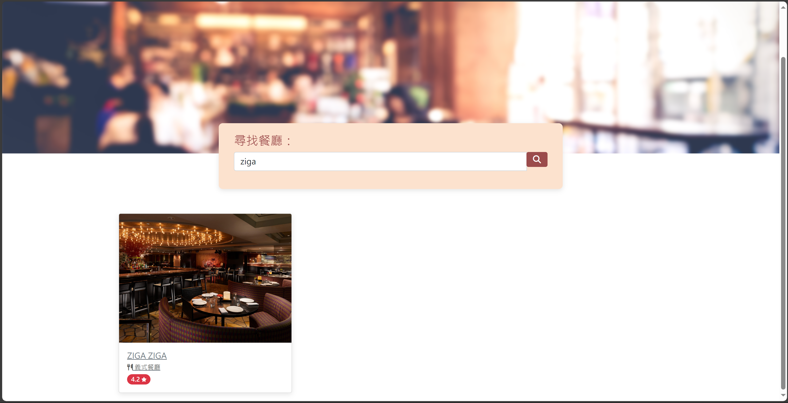

# 精選餐廳清單





## 簡介

提供精選的優質餐廳，可用搜尋功能快速查找，並完整提供餐廳資訊。

### 功能

1. 查看所有精選餐廳
2. 快速搜尋餐廳
3. 瀏覽餐廳的詳細資訊
4. 連結餐廳的地址到 Google 地圖

## 使用步驟

1. 請先確認有安裝 node.js 與 npm
2. 開啟終端機工具: Git Bash
3. 將專案 clone 到本地，請輸入
   ```
   git clone https://github.com/RocanZhang/RestaurantList.git
   ```
4. 在本地開啟之後，透過終端機進入資料夾，輸入：
   ```bash
   npm install
   ```
5. 安裝完畢後，執行專案請輸入：
   ```bash
   npm run start
   ```
6. 若看見此行訊息則代表順利運行，打開瀏覽器進入到以下網址
   ```bash
   Listening on http://localhost:3000
   ```
7. 停止連線狀態，請輸入
   ```bash
   ctrl + c
   ```

## 開發工具

- Node.js 10.15.0
- Express 4.17.1
- Express-Handlebars 5.3.3
- Bootstrap 5.2.1
- Font-awesome 5.8.1
